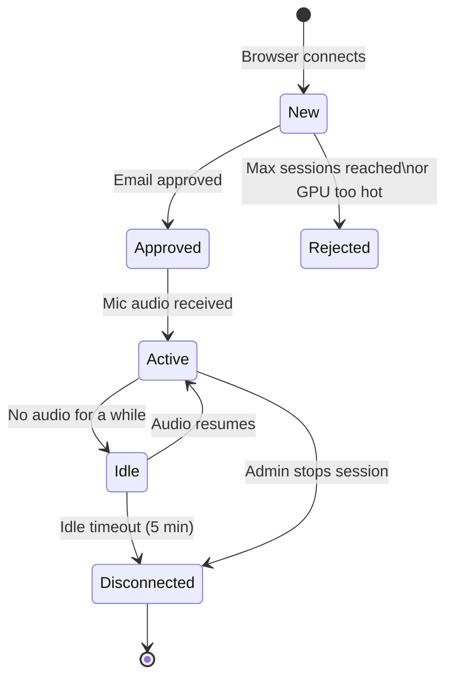
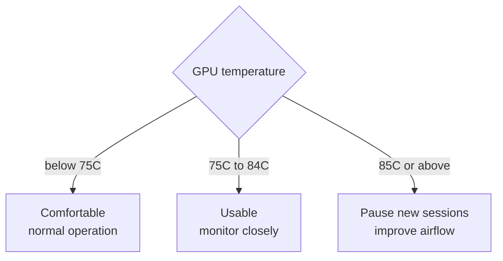

# Setup: GPU And Session Safety

Use this checklist before allowing more than one person to test the translator.

## What The Words Mean

- Active session: one connected browser using the backend WebSocket.
- Idle timeout: how long a connected browser may stay silent before the backend disconnects it.
- Translation queue: speech segments waiting for GPU inference.
- Stale audio: old audio that should be dropped instead of translated late.
- GPU temperature guard: blocks new sessions when `nvidia-smi` reports the GPU is too hot.



*Session lifecycle: from browser connect to disconnect.*

## Default Safe Settings

The protected startup script uses these defaults:

```text
MAX_ACTIVE_SESSIONS=4
IDLE_TIMEOUT_SECONDS=300
MAX_TRANSLATION_QUEUE_SEGMENTS=2
GPU_MAX_TEMPERATURE_C=85
```

Meaning:

- `MAX_ACTIVE_SESSIONS=4`: allows four connected browsers by default.
- `IDLE_TIMEOUT_SECONDS=300`: disconnects after five minutes without microphone audio.
- `MAX_TRANSLATION_QUEUE_SEGMENTS=2`: keeps translation current by dropping older queued speech if the GPU falls behind.
- `GPU_MAX_TEMPERATURE_C=85`: blocks new sessions at or above 85C.

These are backend startup settings. They are not GitHub Pages settings.

## Start With Defaults

```powershell
Set-Location C:\Users\n\source\repos\Transcribe_translate
.\start-translator-stack.ps1
```

## Test Eight Mostly Idle Users Later

Only try this after the default setting is stable:

```powershell
Set-Location C:\Users\n\source\repos\Transcribe_translate
.\start-translator-stack.ps1 -RestartBackend -MaxActiveSessions 8
```

Use `8` only when:

- Users are not talking continuously.
- Latency stays acceptable.
- Dropped queue segments stay low.
- GPU temperature stays below 85C.
- The RTX PC has good airflow.

## What Admin Should Watch

From the web admin panel:

- Active sessions and maximum allowed sessions.
- Email for each connected user.
- Connected time.
- Last microphone audio time.
- Queue size.
- Dropped segment count.
- GPU temperature when `nvidia-smi` is available.

From PowerShell:

```powershell
nvidia-smi
```

## Temperature Guidance

- Below 75C: comfortable.
- 75C to 84C: usable, but watch it.
- 85C or higher: stop adding sessions, improve airflow, or reduce load.



*GPU temperature decision guide.*

## Practical Advice

- Do not run heavy games or other GPU jobs while translating.
- Keep the PC case intake and exhaust clear.
- Prefer fewer active users for serious meetings.
- If translation arrives late, lower `MAX_TRANSLATION_QUEUE_SEGMENTS` or reduce active sessions.
